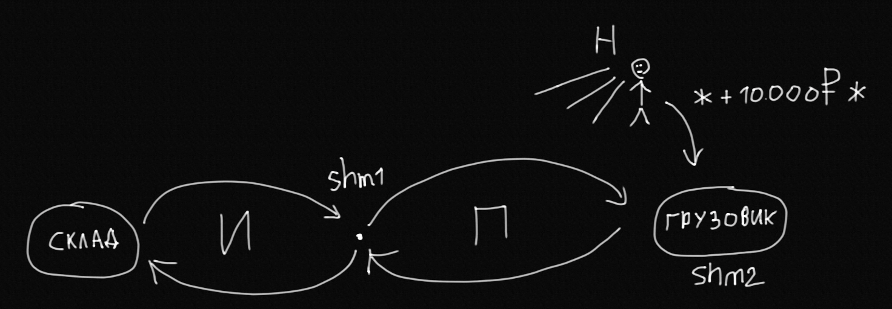

# 4 балла

## Информация об исполнителе

см. `README.md`

## Условие задачи

см. `README.md`  

`$ make mark4` для сборки.  

## Модель решаемой задачи

Примерное устройство модели (семафоры не изображены):

Введем нейтральные обозначения для модели:
- `Stealer` - *Вор* - Иванов;
- `Loader` - *Грузчик* - Петров;
- `Observer` - *Наблюдатель* - Нечепорук.
Данные обозначения используются и в исходном коде программы.

Под сворованным *предметом* в данной модели подразумевается его цена. 

`Stealer`, `Loader`, `Observer` - три процесса, занимающихся выполнением своей части работы (работа зацикливается после '...'):
- `Stealer`: **Ворует предметы из склада**, ждет `Loader` в точке передачи, передает `Loader` предмет, ...
- `Loader`: Ждет, когда `Stealer` принесет новый предмет, принимает предмет от `Stealer`, **погружает предмет в грузовик**, оповещает `Observer` о новом предмете, ... 
- `Observer`: Стоит на шухере, **при получении оповещения от `Loader`, считает количество предметов в грузовике, стоимость нового предмета и общую стоимость сворованных предметов**, ...
  
**Жирным шрифтом** выделены действия процессов, которые занимают случайное время (см. условие задачи).   

При этом коммуникация трех процессов осуществляется через две разделяемые памяти:
- `shm1`: разделяемая память, используемая `Stealer` для передачи `Loader` информации о новом предмете. При этом, если `Stealer` нечего больше воровать, то он передает `Loader` отрицательное число и завершается.
- `shm2`: разделяемая память, массив целых чисел, обозначающий цены всех сворованных предметов, находящихся в грузовике. `Loader` помещает в `shm2` стоимость нового предмета (даже если это отрицательное число), после этого оповещает `Observer` о новом предмете. `Observer` при оповещении смотрит на стоимость последнего добавленного предмета этого массива и делает подсчеты. `Observer` при получении отрицательного числа в качестве стоимости последнего погруженного предмета, останавливает подсчеты, удаляет отрицательное число из этого массива и завершается. 

Синхронизация и коммуникация трех процессов осуществляется через три семафора:
- `sem_block_stealer`: семафор, блокирующий `Stealer`. Используется `Loader` для блокировки `Stealer`, когда `Loader` еще не готов принять новый предмет от `Stealer`; `Stealer` кладет предмет в разделяемую память и ждет пока семафор не разблокируется `Loader`. Только после *получения предмета* (считывания разделяемой памяти) `Loader` разблокирует семафор. Таким образом, `Stealer` не приступит к выполнению новой кражи, пока не *передаст* предмет `Loader`, исключая возможность перезаписи еще не полученного предмета. 
- `sem_block_loader`: семафор, блокирующий `Loader`. Используется `Stealer` для блокировки `Loader`, когда `Stealer` еще не готов передать новый предмет `Loader`; `Loader` ждет пока не разблокируется семафор и только после разблокировки *получает  предмет* (считывает разделяемую память). `Stealer` разблокирует семафор только после записи нового предмета в разделяемую память. Таким образом, `Loader` не приступит к погрузке предмета, пока *не получит предмет* (будет разблокирован `Stealer`), исключая возможность погрузки того же самого предмета.  
- `sem_block_observer`: семафор, блокирующий `Observer`. Используется для оповещения `Observer` о новом загруженном предмете: `Observer` блокируется (*стоит на шухере*), `Loader` разблокирует `Observer`, оповещая о новом предмете после погрузки предмета, `Observer` делает подсчеты и снова блокируется (*встает на шухер*).  

**Заметим, что устройство работы `sem_block_stealer` и `sem_block_loader` реализует условие задачи "Иванов выносит имущество со склада и `передает его в руки` Петрову", то есть `Stealer` и `Loader` ждут пока другой не освободится и только после этого происходит передача предмета**

Условие задачи требует создания конкретного числа процессов - трех. Возможность задания произвольного числа процессов через аргументы командной строки не требуется в реализации.    
Было решено не создавать отдельную разделенную память под склад (из которого ворует `Stealer`), т. к. лишь только `Stealer` обращается к этому складу, хоть, может и концептуально склад - разделяемая память.  

## Запуск программы

Используйте `./mark4 item_price...`, где:
- `item_price...`: вариативный аргумент, последовательность целых положительных чисел, разделенных пробелом, где каждое число задает стоимость очередного предмета (*партии военного имущества*) в складе; при пустом `item_price` (т. е. при запуске программы с помощью `$ ./mark4`) в качестве стоимостей предметов будут использованы случайные целые числа в диапазоне `[1, 10000]`, количество чисел будет тоже случайным в диапазоне `[1, 20]`.  

Число предметов на складе таким образом подсчитывается `на лету`.  

### Примеры команд для запуска программы
- `$ ./mark4 1 2 3`: запуск программы с тремя предметами, стоимостью 1, 2 и 3 соответственно.
- `$ ./mark4 1000000`: запуск программы с одним предметом, стоимостью 1000000.
- `$ ./mark4 42 99 111 129361239`, запуск программы с четырьмя предметами, стоимостью 42, 99, 111 и 129361239 соответственно.
- `$ ./mark4`: запуск программы со случайным числом предметов со случайными стоимостями (см. выше).

## Завершение программы
Программа может завершаться как через сигнал `SIGINT` (*ctrl+c*), так и самостоятельно, после того как все 3 процесса завершили работу. Программа также пытается *gracefully* завершиться при возникновении какой либо ошибки в дочерних процессах, завершая остальные процессы и себя.  
При этом во всех случаях программа производит подчистку ресурсов (удаление семафоров и разделяемой памяти), вызывая функцию `cleanup()`.

После завершения работы каждого процесса (как успешного, так и с ошибкой), процессы производят подчистку файловых дескрипторов. Это возможно благодаря реализации соответствующего паттерна `goto cleanup` (см. https://eli.thegreenplace.net/2009/04/27/using-goto-for-error-handling-in-c).

## Вариант реализации

Был выбран вариант реализации с использованием именованных POSIX семафоров и разделяемой памяти в стандарте POSIX (*imho, posix семафоры намного легче и понятнее*).  

# 5 баллов

`$ make mark5` для сборки.  

## Модель решаемой задачи

Модель решаемой задачи соответствует представленной на 4 балла, за исключением того, что используются неименованные POSIX семафоры.  

## Запуск программы

Используйте `./mark5 item_price...` для запуска программы (см. выше).

## Вариант реализации 

Был выбран вариант реализации с использованием неименованных POSIX семафоров, расположенных в разделяемой памяти, и разделяемой памяти в стандарте POSIX.

# 6 баллов

`$ make mark6` для сборки.  

## Модель решаемой задачи

Модель решаемой задачи соответствует представленной на 4 балла, за исключением того, что используется разделяемая память и семафоры стандарта Unix System V.  

## Запуск программы

Используйте `./mark6 item_price...` для запуска программы (см. выше).

## Вариант реализации 

Был выбран вариант реализации с использованием разделяемой памяти и семафоров стандарта Unix System V.
